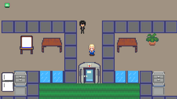
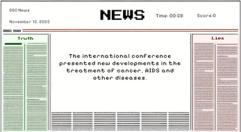
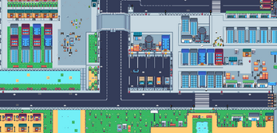
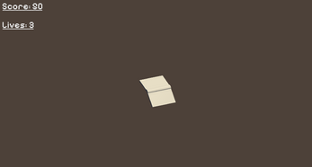

# The Search for TRUTH

A role-playing game in which journalist Alex tries to get to the truth in a world full of misinformation.

## Pillars of Design:

Critical thinking, search for truth, investigation. 

## Genre/Story/Mechanics:

In this game, the player takes on the role of journalist Alex, who finds himself in a world full of misinformation. Through research and dialog, the player uncovers the truth behind various events and narratives. The player explores various locations, interacts with various characters and accepts quests from them. These quests lead to mini-games and challenges where the player will have to apply critical thinking. Eventually, the player will send the collected clues to the media to declassify Mr. Ben's dirty deeds.

## Gameplay:

The player must reach a certain number of articles and Mr. Ben's not-so-clean affairs and eventually get permission to publish in the media paralleling contact with various characters and clickable items. In the first mini-game, the player is presented with information. His task is to determine whether this information is true or false. He must carefully analyze the details presented and apply critical thinking. For each correctly determined piece of information, the player earns points. However, for each incorrect determination, the player loses points.  In the second mini-game, the player is presented with torn pieces of newspapers scattered across the screen. This is a puzzle game, the player's goal is to restore the original image. He has to put all the pieces together by dragging them to the correct position.  In the third mini-game, the player controls a newspaper object moving through a dynamic environment. The newspapers must be objective and free of misinformation. The player's task is to guide the newspaper object through the level, avoiding obstacles that represent misinformation. In the fourth mini-game, there we try to collect truthful articles to collect a certain number of newspapers and cut only bombs. As the player progresses, he earns points for successfully overcoming obstacles.

Gameplay video: https://www.youtube.com/watch?v=7zZhdMebaVI

## Features:

Mini-games:
Various game mechanics such as distinguishing between true and false information, assembling puzzles, avoiding obstacles and cutting bombs among truthful articles. They bring variety to the game.  Interface: The player uses a combination of keyboard and mouse.

## Art style:

The game uses a pixel art style. Games with similar aesthetics: Pixel Survival Game 3.

## Music/Sound:

The music in the menu creates a calm and joyful atmosphere. On the contrary, the in-game music with gradually decreasing tonality evokes a sense of anxiety and tension that turns melancholy. The absence of music on the game's completion screen lends weight to the loss, allowing players to reflect on its consequences for the character.

## Screenshots

